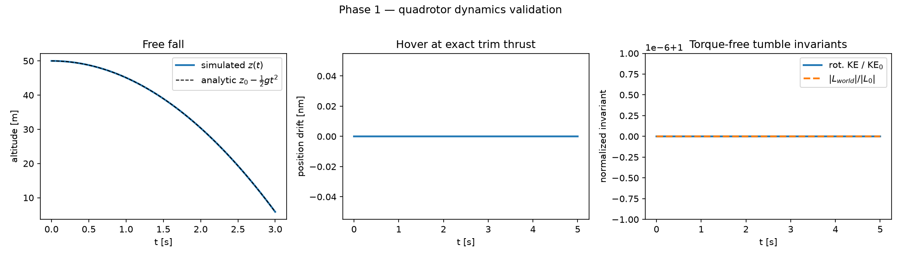

# Quadrotor MPC — Real-Time Nonlinear Model Predictive Control with Dynamic Obstacle Avoidance

> **Work in progress.** Phased build: dynamics → PID baseline → nonlinear MPC →
> obstacle courses → metrics → live 3D visualization → results/analysis.
> This README will be rewritten with full results when the project is complete.

Real-time nonlinear MPC flying a simulated quadrotor through courses of static
and moving obstacles, compared head-to-head against a cascaded PID baseline,
with a live 3D visualization of the receding-horizon predicted trajectory
replanning every control cycle.

## Status

- [x] **Phase 1 — Dynamics.** Nonlinear rigid-body quadrotor model
      (13 states: position, velocity, unit quaternion, body rates; inputs:
      collective thrust + body torques), RK4 integration, motor mixer with
      per-motor thrust limits. Validated against closed-form physics:
      free fall, hover trim, principal-axis torque ramps, tilted-thrust
      kinematics, torque-free tumble invariants (energy and angular momentum
      conserved to ~1e-13), and an RK4 order-of-convergence check.
- [ ] Phase 2 — Cascaded PID baseline (position → attitude → rate)
- [ ] Phase 3 — Nonlinear MPC (CasADi/IPOPT, receding horizon)
- [ ] Phase 4 — Obstacle courses with moving obstacles
- [ ] Phase 5 — Instrumented metrics (solve time, collisions, tracking error)
- [ ] Phase 6 — Live 3D visualization with predicted-trajectory overlay
- [ ] Phase 7 — Results, analysis, polished docs

## Quick start

```bash
python -m venv .venv
.venv/Scripts/activate        # Windows; use source .venv/bin/activate on Unix
pip install -r requirements.txt
pytest tests -q               # physics validation suite
python scripts/validate_dynamics.py   # regenerates the Phase 1 figure
```



## Repo layout

```
dynamics/   rigid-body quadrotor model, parameters, quaternion math
control/    controllers: pid/ (baseline), mpc/ (CasADi nonlinear MPC)
sim/        closed-loop simulation harness, obstacle courses
viz/        3D animated visualization
tests/      physics + controller validation
scripts/    entry points (validation, experiments, figure generation)
results/    figures and metrics tables
docs/       model + MPC formulation notes
```
