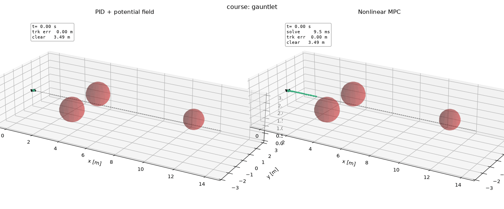
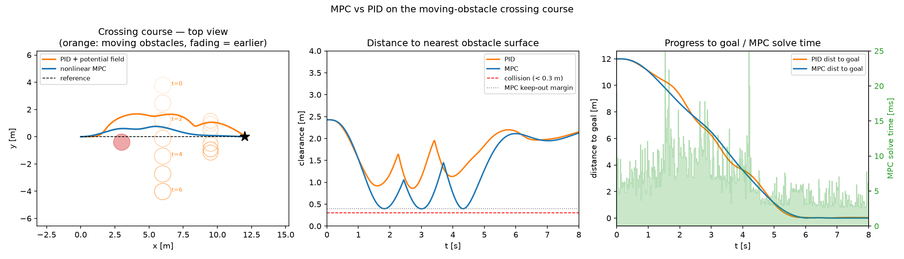
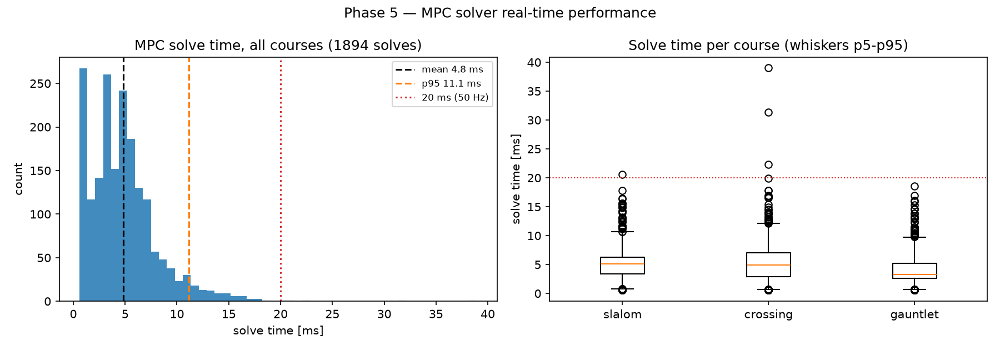

# Real-Time Nonlinear MPC for Quadrotor Flight Through Moving Obstacles

> **Resume bullet (measured, reproducible):** Designed and implemented a
> real-time nonlinear Model Predictive Controller (CasADi/IPOPT, 1.5 s
> receding horizon re-solved at 50 Hz) flying a simulated quadrotor
> through courses of static and moving obstacles: **100% success and
> zero collisions across 3 obstacle courses vs 67% success (1 collision)
> for a tuned cascaded-PID + potential-field baseline**, with **4.8 ms
> mean / 11.1 ms p95 solve times** over 1,894 receding-horizon solves;
> built the quaternion rigid-body simulation, the PID baseline, and a
> live 3D visualization of the predicted trajectory replanning every
> control cycle.



*Gauntlet course: a narrow gate, then a head-on obstacle closing at
1.5 m/s. Left — the reactive PID baseline swerves late. Right — the
MPC's predicted horizon (green ribbon) bends around the mover seconds
before contact, because the obstacle's known trajectory is part of the
constraint set over the horizon.*

## What this is

A pure-software applied-controls project comparing two philosophies on
identical tasks:

- **Baseline:** cascaded PID (position → attitude → rate, PX4-style)
  plus Khatib potential-field avoidance with vortex + closing-rate
  damping terms — a deliberately competent reactive stack, not a
  strawman.
- **Contender:** nonlinear receding-horizon MPC (direct multiple
  shooting, CasADi + IPOPT) with obstacle keep-outs as inequality
  constraints and moving obstacles sampled along their known future
  trajectories.

Both close the loop around the same 13-state quaternion rigid-body
simulation (RK4 at 500 Hz, motor-mixer-accurate actuator saturation)
and fly the same three courses with obstacle-blind straight-line
references — obstacle handling is entirely the controller's job.

## Results

| Course | Controller | Success | Collided | Min clear. [m] | Time to goal [s] | Path eff. | Mean track err [m] | Solve mean [ms] | Solve p95 [ms] |
|---|---|---|---|---|---|---|---|---|---|
| slalom | PID | no | **YES** | 0.14 | — | 0.74 | 0.86 | — | — |
| slalom | MPC | **yes** | no | 0.40 | 5.60 | 0.93 | 0.16 | 5.1 | 10.6 |
| crossing | PID | yes | no | 0.86 | 5.42 | 0.91 | 0.42 | — | — |
| crossing | MPC | **yes** | no | 0.39 | 5.54 | 0.98 | 0.15 | 5.4 | 12.1 |
| gauntlet | PID | yes | no | 0.56 | 6.28 | 0.89 | 0.34 | — | — |
| gauntlet | MPC | **yes** | no | 0.38 | 6.32 | 0.98 | 0.11 | 4.1 | 9.8 |

Collisions are scored against the drone's 0.30 m body radius — the
same inflation the MPC's constraints use, so the comparison is honest.



The middle panel is the thesis of the project in one plot: the MPC
rides *exactly* on its 0.40 m keep-out floor three separate times —
constrained optimization using precisely the margin it was given —
while the reactive baseline oscillates with large, inefficient margins.



## The controllers

**Nonlinear MPC** (`control/mpc/`): 10-state internal model (position,
velocity, quaternion) with thrust + body-rate inputs tracked by an
inner rate loop; N = 20 × 75 ms horizon; costs on tracking, input
effort, and input rate; hard sphere keep-outs (inflated by body radius
+ margin) softened by expensive per-stage slacks so the NLP never goes
infeasible. Built once as an SX-expanded `nlpsol`; warm-started
(primal + dual) every cycle; anytime-IPOPT settings cap tail latency.
The path from a 72 ms naive implementation to 5 ms is documented in
[docs/model_and_mpc.md](docs/model_and_mpc.md).

**Cascaded PID** (`control/pid/`): position PID with conditional-
integration anti-windup → tilt-limited thrust-vector attitude setpoint
→ attitude P → rate P with gyroscopic feedforward, all mapped through
the motor mixer for realistic saturation.

## Run it

```bash
python -m venv .venv
.venv/Scripts/activate            # Windows (source .venv/bin/activate on Unix)
pip install -r requirements.txt

pytest tests -q                   # 33 tests: physics, controllers, courses, metrics

python scripts/run_experiments.py # all courses × both controllers → metrics table
python scripts/animate_course.py --course gauntlet --mode both   # live 3D window
python scripts/animate_course.py --course slalom --mode both --save out.gif
```

Phase-by-phase validation figures: `scripts/validate_dynamics.py`,
`validate_pid.py`, `validate_mpc.py`; final figures:
`make_final_figures.py`.

## Repo layout

```
dynamics/   rigid-body model, parameters, quaternion math (13-state truth)
control/    pid/ cascade + potential field   mpc/ CasADi NLP controller
sim/        simulator harness, obstacle courses, references, metrics
viz/        3D animation (drone glyph, predicted-horizon ribbon, readouts)
tests/      33 validation tests (physics vs closed form, closed-loop behavior)
scripts/    validation, experiments, animation entry points
results/    figures/ (committed), metrics tables, raw/ logs (regenerable)
docs/       model + MPC formulation + solver engineering notes
```

## Honest scope

Obstacle trajectories are known to the MPC (control, not perception,
is the topic); the controller sees true state (no estimator); keep-out
constraints are nonconvex so IPOPT commits to a locally optimal side.
Details and limitations: [docs/model_and_mpc.md](docs/model_and_mpc.md).
